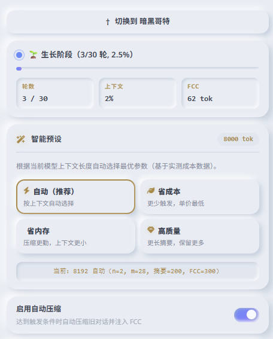
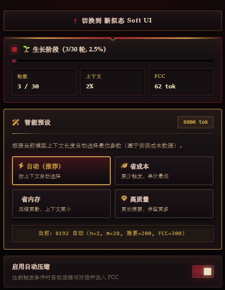
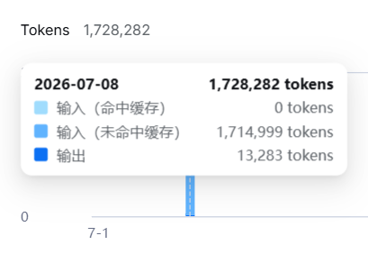

# TokenSavingPlugin

**SillyTavern 专属 · n+m 分段生长策略上下文压缩插件**

> 极致缓存命中优化 · 自动滑动窗口 · 智能参数预设

**标签**：`<酒馆>` `<sillytavern>` `<插件>` `<缓存命中>` `<角色扮演>` `<上下文>` `<提示词>` `<缓存机制>` `<酒馆插件>` `<省钱>` `<API>` `<LLM>` `<总结>` `<摘要>` `<Token>` `<大肥鱼>`


---

## 目录

- [项目简介](#项目简介)
- [为什么你需要这款插件？](#为什么你需要这款插件)
- [TokenSavingPlugin 的解决方案](#tokensavingplugin-的解决方案)
- [缓存命中实测效果](#缓存命中实测效果)
- [核心特性](#核心特性)
- [安装](#安装)
- [快速开始](#快速开始)
- [实测成本数据](#实测成本数据)
- [工作原理](#工作原理)
- [常见问题](#常见问题)
- [更新日志](#更新日志)
- [作者](#作者)
- [许可证](#许可证)

---

## 项目简介

TokenSavingPlugin 是一款面向 SillyTavern 的上下文压缩和提高缓存命中的插件，可以将原本 50% 缓存的命中，提高到 90% 甚至 94%。

依托 **n+m 分段生长策略**，当对话长度超出阈值时，插件会自动将久远的对话内容压缩为摘要，并追加至 **FCC（冻结压缩典籍）** 块。在完整保留对话叙事连贯性的前提下，大幅降低 Token 消耗。

---

## 把缓存命中率从 45% 拉到 90%+

如果你厌倦了每天在 SillyTavern 里聊上百句话，回头一看账单：因为缓存命中率过低，只有 **45%～55%**，每月 API 开销就要 **30 元甚至更多**——那么这个插件非常适合你。

它能把你的缓存命中率从 **45% 提升到至少 90%**。让你不再因为“想聊，却还欠梁圣 **0.08 元**”而被大肥鱼直接拒绝，也不再只能盯着屏幕上那行字：

> 余额不足，请登录平台查看余额信息。

然后心情失落。这个插件，正是为解决这个痛点而生。

**实际使用情况如下：**

1. 打开 SillyTavern，安装 `TokenSavingPlugin`。
2. 看着雪白的面板，在酒馆的响应配置里，将上下文长度设为 `8192` 或更高。
3. 点击插件面板的“自动”，它会自动填入对应参数——无需思考，简单快捷。
4. 然后尝试上百次甚至上千次对话。
5. 你会发现，账单从原本每月固定 **30 元**开销，变成 **10 元甚至更低**。既解决了酒馆痛点，也充实了你的钱包。




---

## 为什么你需要这款插件？

长对话场景下，SillyTavern 默认机制会遇到这些痛点：

- **Token 爆炸**：对话累积几十轮后，历史记录会快速占满上下文窗口。
- **截断失忆**：原生逻辑直接丢弃最早的消息，造成角色记忆丢失。
- **费用失控**：每一轮请求都携带完整对话历史，API 开销线性上涨。
- **缓存失效**：对话上下文持续变动，API 缓存前缀频繁失效，无法复用缓存。

---

## TokenSavingPlugin 的解决方案

| 痛点 | 解决方案 |
| :--- | :--- |
| Token 爆炸 | 将滑出窗口的历史对话压缩为摘要，压缩比最高可达 80%+ |
| 截断丢记忆 | 摘要提取关键剧情、人物关系与情绪，AI 可长期保留记忆 |
| API 费用高 | 构建稳定前缀，充分利用 API 缓存，单次调用成本降低 30%~50% |
| 缓存命中差 | FCC 块仅追加、永不修改，形成固定稳定前缀，持续命中缓存 |


### 账单爆炸与缓存未命中

当你在酒馆里调用 API 愉快聊天的时候，是不是咔嚓一下发现账单爆炸？是不是手忙脚乱切换时区想要拯救一下，结果发现几百万的提示词全部未命中？

就像图中这样：



用了此插件后：

---

## 缓存命中实测效果

原生酒馆动态上下文会不断裁剪历史，一旦旧消息被截断，缓存前缀直接断裂，后续全部内容无法复用缓存。

而本插件将溢出窗口的历史压缩为 200~300 Token 的摘要并前置注入对话，持续追加的稳定前缀可以稳定命中 API 缓存。

> 下面为线上真实时段缓存命中率统计：

| 时段 | 命中输入 | 未命中输入 | 输出 | 总输入 | 命中率 |
| ---- | -------: | --------: | ---: | -----: | -----: |
| 22:00~23:00 | 568,957 | 109,999 | – | 678,956 | 83.80% |
| 23:00~24:00 | 305,663 | 43,012 | 13,438 | 348,675 | 87.67% |
| 00:00~01:00 | 280,191 | 26,568 | 5,960 | 306,759 | 91.34% |
| 00:00~01:00 | 335,743 | 29,831 | 6,932 | 365,574 | 91.84% |
| 00:00~01:00 | 1,110,143 | 77,190 | 20,631 | 1,187,333 | 93.50% |
| 01:00~02:00 | 524,288 | 56,079 | 13,719 | 580,367 | 90.34% |
| 02:00~03:00 | 7,282,680 | 387,842 | 161,945 | 7,670,522 | 94.94% |

---

## 核心特性

- **n+m 分段生长策略**：自研滑动窗口机制，自动管理对话历史，压缩行为稳定可控。
- **冻结压缩典籍（FCC）**：摘要仅追加、不修改已有内容，最大化 API 前缀缓存命中率。
- **智能预设**：根据模型上下文窗口大小自动推荐最优参数，基于大量实测成本数据。
- **三重防爆保护**：Prompt 长度校验 + 底层代码硬截断 + FCC 预算折叠多层兜底。
- **Feynman 质量自检**：压缩完成后自动校验关键信息完整性；校验失败自动回退原文。
- **压缩锁定机制**：压缩过程锁定输入框，避免并发消息冲突；支持手动终止压缩任务。
- **现代化毛玻璃 UI**：磨砂玻璃 + 香槟金视觉风格，自动适配暗色/亮色主题。

---

## 安装

### 方式一：Git 安装（推荐）

打开 SillyTavern 扩展面板，粘贴仓库地址：

```text
https://github.com/cloudfox-open/TokenSavingPlugin
```

点击 `Install Extension` 完成安装。

### 方式二：手动安装

1. 下载本仓库源码。
2. 将文件夹重命名为 `TokenSavingPlugin`。
3. 放入目录：`SillyTavern/public/scripts/extensions/third-party/`。
4. 浏览器刷新页面（F5）。

> **提示**：手动安装模式下，自动更新会提示 `not a Git repository`，该报错不影响插件全部功能。Git 安装方式无此提示。

---

## 快速开始

1. 加载角色卡，正常开启对话。
2. 打开扩展面板，找到 `TokenSavingPlugin`。
3. 在「智能预设」中点击 **自动**，插件会根据上下文自动配置参数。
4. 正常聊天，当对话达到阈值后会自动触发压缩，状态卡片实时展示进度。
5. 如果需要立即压缩，点击 **立即压缩** 手动触发。

### 参数详解

| 参数 | 说明 | 默认值 | 推荐范围 |
| ---- | :--- | -----: | :------ |
| 启用自动压缩 | 插件总开关 | 开启 | — |
| n（保留原文轮数） | 永久保留最近 n 轮对话原文，不参与压缩 | 2 | 1~4 |
| m（滑动窗口增量） | 可见对话轮数超过 `n+m` 时触发压缩 | 8 | 见下表 |
| Token 兜底阈值 | 轮数未超限，但 Token 占用达到阈值时兜底触发压缩 | 80% | 75~90% |
| 单次摘要上限 | 单次压缩产出摘要的最大 Token 数量 | 180 | 100~300 |
| FCC 总预算 | FCC 块最大 Token 上限，超出后触发折叠 | 300 | 200~800 |
| Feynman 自检 | 压缩后校验关键信息是否丢失 | 开启 | 推荐始终开启 |

### m 值推荐参考

> 经验公式：`m ≈ 上下文窗口 / 300`

| 上下文窗口 | 推荐 m 值 | 说明 |
| ---- | -------: | :--- |
| 4096 | 8~12 | m 过小会频繁触发压缩，过大则单次压缩成本上升 |
| 8192 | 24~32 | 性能甜点，推荐 m=28 |
| 16k | 28~40 | — |
| 32k+ | 36~50 | — |

### 智能预设面板

面板内置 4 套一键预设，点击即可切换配置：

| 预设 | 适用场景 | 特点 |
| ---- | :--- | :--- |
| 自动 | 默认推荐 | 根据模型上下文长度自动选择最优参数 |
| 省成本 | 预算敏感场景 | 增大 m 值，减少压缩触发次数，降低单轮开销 |
| 省内存 | 上下文窗口紧张 | 减小 m 值，压缩更频繁，控制整体 Token 占用 |
| 高质量 | 复杂长篇剧情 | 加长摘要，保留更多剧情细节 |

> 手动修改任意参数后，插件自动切换为「自定义配置」，预设按钮取消选中。

---

## 实测成本数据

> 数据基于 DeepSeek API 真实压测。

| 上下文 | m 值 | 调用次数 | 总花费（元） | 单价（元/次） | 结论 |
| ---- | -------: | -------: | -------: | -------: | :--- |
| 4096 | 3 | 56 | 0.06 | 0.00107 | 压缩触发过于频繁 |
| 4096 | 12 | 118 | 0.10 | 0.00085 | 性能明显改善 |
| 8192 | 28 | 106 | 0.05 | 0.00047 | 最优甜点配置 |
| 8192 | 60 | 329 | 0.18 | 0.00055 | 单次压缩成本上升 |

**核心结论**：最优 `m ≈ 上下文窗口 × 0.35%`。8192 上下文窗口场景，单次请求成本约为 4096 的一半（更长稳定缓存前缀）。

---

## 工作原理

### 数据流

1. AI 回复完成。
2. 计算当前可见对话轮数与 Token 占用比例。
3. 判断触发条件：窗口溢出（轮数 > `n+m`）**或** Token ≥ 阈值。
4. 锁定输入框 + 隐藏待压缩消息。
5. 分块提交至 AI 进行压缩（单块上限 ≤ 800 token）。
6. Feynman 自检（可选）。
7. 追加摘要到 FCC + 持久化保存 + 注入 Prompt。
8. 解锁输入框。

---

## 常见问题

<details>
<summary><b>Q1: 为什么插件刚开始聊天不会触发压缩？</b></summary>

压缩需要满足**任一**条件才会启动：可见对话轮数超过 `n + m`；或者 Token 占比达到阈值（默认 80%）。对话前几轮属于“生长阶段”，正常继续聊天即可。

</details>

<details>
<summary><b>Q2: 压缩触发太频繁 / 很久都不压缩？</b></summary>

- **压缩过于频繁**：增大参数 `m`，或直接切换「省成本」预设。
- **压缩很久不触发**：减小参数 `m`，或切换「省内存」预设。

</details>

<details>
<summary><b>Q3: 压缩会不会丢失剧情记忆？</b></summary>

**不会**。三层安全保护：

1. Feynman 自检：检测到关键信息丢失时自动回退原文。
2. 压缩调用失败，自动恢复原始对话内容。
3. FCC 只追加写入，历史摘要永久保存。

最坏场景：压缩任务失败，对话保持原样，消息不会隐藏或丢失。

</details>

<details>
<summary><b>Q4: 支持哪些 API 服务商？</b></summary>

支持所有 SillyTavern 可对接的 API：DeepSeek / OpenAI / Claude / Gemini / 本地大模型等。

> 不支持 JSON Schema 的 API 会自动降级到普通压缩模式。

</details>

<details>
<summary><b>Q5: 压缩的时候输入框为什么变灰无法发送？</b></summary>

这是**保护机制**，防止压缩任务运行时用户发送消息，造成对话生成与压缩任务冲突。

如果需要中断压缩，可以点击红色 **停止压缩** 按钮，插件会恢复原始对话。不用担心，压缩通常只要 1~2 秒。

</details>

<details>
<summary><b>Q6: 为什么开启 Feynman 的时候一堆 API 返回错误 UnprocessableEntity？关掉的时候只会出现一次返回错误？</b></summary>

`/chat/completions` 兼容 OpenAI 的对话接口，不支持 OpenAI 新版 `response_format={"type":"json_schema", ...}` 结构化输出。只有 DeepSeek 新的 `/responses` API 才支持 `json_schema` 参数。

</details>

<details>
<summary><b>Q7: 为什么安装的时候出现 SyntaxError: Expected ',' or '}' after property value in JSON at position 416 (line 14 column 33)？</b></summary>

这是因为插件代码原因，现已修复。

</details>

---

## 更新日志

完整更新记录详见 `CHANGELOG.md`。

### v1.4.0

- 新增智能预设：自动 / 省成本 / 省内存 / 高质量。
- 默认参数更新为适配 4096 上下文的甜点配置。
- 基于实测成本数据优化 m 值推荐规则。

### v1.3.0

- 压缩期间锁定输入框和发送按钮。
- 新增「停止压缩」按钮，支持随时中断任务。

---

## 作者

cloudfox-open

- GitHub：[@cloudfox-open](https://github.com/cloudfox-open)
- 项目主页：[TokenSavingPlugin](https://github.com/cloudfox-open/TokenSavingPlugin)

---

## 许可证

MIT License

---

<div align="center">

如果这个项目对你有帮助，欢迎点亮 Star ⭐

Made with ❤️ by cloudfox-open

</div>
